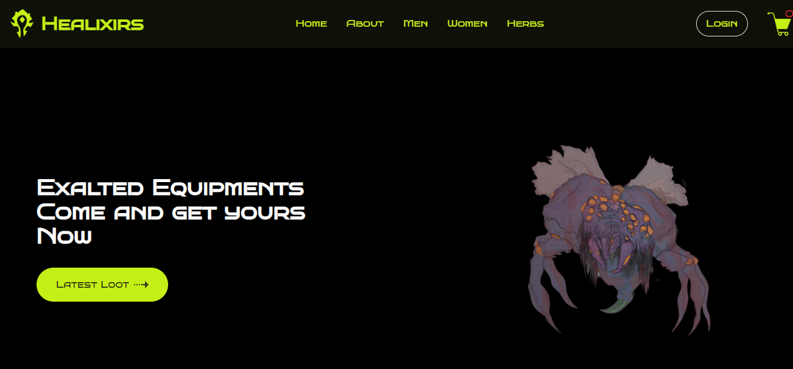

# Healixirs E-Commerce Website


## Description

Healixirs is a full-stack e-commerce website designed to provide users with a seamless shopping experience. From browsing products to making secure payments, Healixirs offers a range of features to meet your online shopping needs. Built with modern technologies, this website prioritizes user experience and performance.

## Features

- **User Authentication:** Users can register, login, and logout securely.
- **Product Management:** Admins can add, edit, and remove products from the inventory.
- **Shopping Cart:** Users can add products to their cart and proceed to checkout.
- **Payment Integration:** Integrated CHAPA API for secure payment processing.
- **Responsive Design:** The website is optimized for various devices and screen sizes.
- **Product Filtering:** Users can filter products by category for easy navigation.

## Technologies Used

- **Frontend:**
  - React
  - React Router DOM
  - Tailwind CSS

- **Backend:**
  - Express.js
  - MongoDB
  - Mongoose

- **Others:**
  - CHAPA API for payment processing

## Setup Instructions

1. Clone the repository:
   ```bash
   git clone <repository_url>

## Getting Started

### Prerequisites

Before running the project, make sure you have Node.js and npm installed on your machine.

### Installation

1. Navigate to the project directory:

    ```bash
    cd Healixirs
    ```

2. Install dependencies:

    ```bash
    npm install
    ```

### Development Server

To start the development server, run:

```bash
npm run dev
```



[](https://app.netlify.com/sites/healixirs/deploys)
